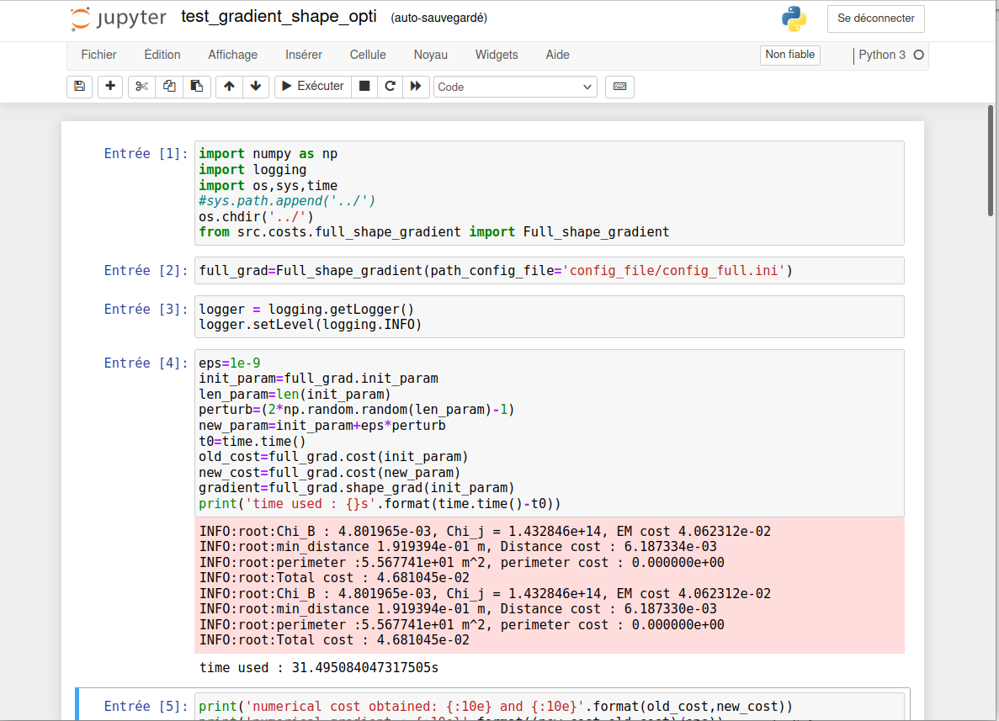

Python code for CWS shape optimization.
---
TODO :  add link to article
## Installation steps
1. Check that [python 3](https://www.python.org/downloads/), [Anaconda](https://www.anaconda.com/products/individual) and [git](https://git-scm.com/downloads) are installed.
2. Clone the git repository :
    ```
    git clone https://plmlab.math.cnrs.fr/rrobin/stellacage_code.git    #clone the repo
    cd stellacage_code/ #go to the new folder
    ```
3. Create a virtual python environment with conda with the needed package:
    ```
    # create a new virtual environment named stellacage_code
    conda create --name stellacage_code python=3.6 matplotlib scipy dask opt_einsum jupyter
    conda activate stellacage_code # activate the environment
    ```
4. (optional) install [Mayavi](https://docs.enthought.com/mayavi/mayavi/) for 3D visualization
    ```
    pip install vtk
    pip install mayavi
    ```
5. (optional) run the tests. It can be memory expensive, around 16-20 GB and takes a few minutes.
    ```
    python -m unittest discover -s test
    ```
## Basic use
1. Ensure the virtual environment is activated
    ```
    conda activate stellacage_code # activate the environment
    ```
2. Launch a [Jupyter Notebook](https://jupyter.org/)
    ```
    jupyter-notebook
    ```
3. open a file your Browser, for example : examples/test_gradient_shape_opti.ipynb


## Uninstall
1. delete the virtual environment
    ```
    conda deactivate
    conda env remove -n stellacage_code
    ```
2. remove the git folder (from the parent folder of stellacage_code)
    ```
    rm -rf stellacage_code
    ```
## License
Copyright 2021-present [Rémi Robin](https://rrobin.pages.math.cnrs.fr/) and [Stellacage](https://www.ljll.math.upmc.fr/~sigalotti/cage/stellacage.html),

Released under the [MPL 2 license](https://mozilla.org/MPL/2.0).
