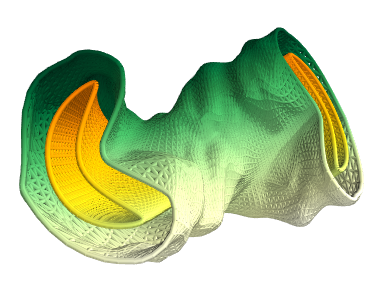

.. stellacode documentation master file, created by
   sphinx-quickstart on Thu Jul  1 16:30:00 2021.
   You can adapt this file completely to your liking, but it should at least
   contain the root `toctree` directive.

Welcome to Stellacode's documentation!
===========================================
.. toctree::
   :maxdepth: 1

   sources/installation
   sources/tutorials/quickstart
   sources/configurations
   sources/contribute
   sources/uninstall
   sources/license

**Stellacode** is an open source Python library (under `MPL 2 license <https://www.mozilla.org/en-US/MPL/2.0/FAQ/>`_) for Coil Winding Surface (CWS) optimization in Stellarator physics.
The main repository is hosted `here <https://plmlab.math.cnrs.fr/rrobin/stellacode>`_ .

The code is developped inside the `Stellacage <https://www.ljll.math.upmc.fr/~sigalotti/cage/stellacage.html>`_ collaboration between `Inria <https://www.inria.fr/en>`_ and `Renaissance fusion <https://stellarator.energy/>`_ .

Differences and similarities with `Regcoil <https://github.com/landreman/regcoil>`_
---------------------------------------------------------------------------------------

The `Regcoil <https://github.com/landreman/regcoil>`_ code developed
by `Landreman Group <https://terpconnect.umd.edu/~mattland/>`_ possesses many comparable features.
TODO

.. warning::

   This project is under active development.

Indices and tables
==================

* :ref:`genindex`
* :ref:`modindex`
* :ref:`search`
